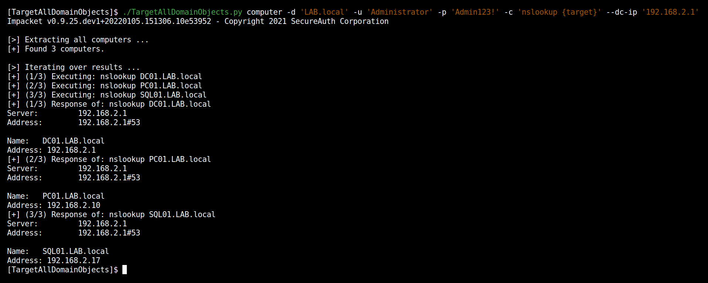

# TargetAllDomainObjects

<p align="center">
  A python wrapper to run a command on against all users/computers/DCs of a Windows Domain
  <br>
  
  
  <a href="https://twitter.com/intent/follow?screen_name=podalirius_" title="Follow"></a>
  <br>
</p>




## Features

 - [x] Only requires a **low privileges domain user account**.
 - [x] Automatically gets the list of all users/computers/DCs from the domain controller's LDAP.
 - [x] Multithreaded command execution.
 - [x] Saves the output of the commands to a file.

## Usage

```              
$ ./TargetAllDomainObjects.py -h          
Impacket v0.9.25.dev1+20220105.151306.10e53952 - Copyright 2021 SecureAuth Corporation

usage: TargetAllDomainObjects.py [-h] -c COMMAND [-ts] [--use-ldaps] [-q] [-debug] [-colors] [-t THREADS] [-o OUTPUT_FILE] --dc-ip ip address [-d DOMAIN]
                                 [-u USER] [--no-pass | -p PASSWORD | -H [LMHASH:]NTHASH | --aes-key hex key] [-k]
                                 targetobject

Wrapper to run a command on against all users/computers/DCs of a Windows Domain.

positional arguments:
  targetobject          Target object (user, computer, domaincontroller)

optional arguments:
  -h, --help            show this help message and exit
  -c COMMAND, --command COMMAND
                        Command to launch, with {target} where the target should be placed.
  -ts                   Adds timestamp to every logging output
  --use-ldaps           Use LDAPS instead of LDAP
  -q, --quiet           show no information at all
  -debug                Debug mode
  -colors               Colored output mode
  -t THREADS, --threads THREADS
                        Number of threads (default: 5)
  -o OUTPUT_FILE, --output-file OUTPUT_FILE
                        Output file to store the results in. (default: shares.json)

authentication & connection:
  --dc-ip ip address    IP Address of the domain controller or KDC (Key Distribution Center) for Kerberos. If omitted it will use the domain part (FQDN)
                        specified in the identity parameter
  -d DOMAIN, --domain DOMAIN
                        (FQDN) domain to authenticate to
  -u USER, --user USER  user to authenticate with

  --no-pass             Don't ask for password (useful for -k)
  -p PASSWORD, --password PASSWORD
                        Password to authenticate with
  -H [LMHASH:]NTHASH, --hashes [LMHASH:]NTHASH
                        NT/LM hashes, format is LMhash:NThash
  --aes-key hex key     AES key to use for Kerberos Authentication (128 or 256 bits)
  -k, --kerberos        Use Kerberos authentication. Grabs credentials from .ccache file (KRB5CCNAME) based on target parameters. If valid credentials
                        cannot be found, it will use the ones specified in the command line
                      
```

## Demo


## Contributing

Pull requests are welcome. Feel free to open an issue if you want to add other features.

